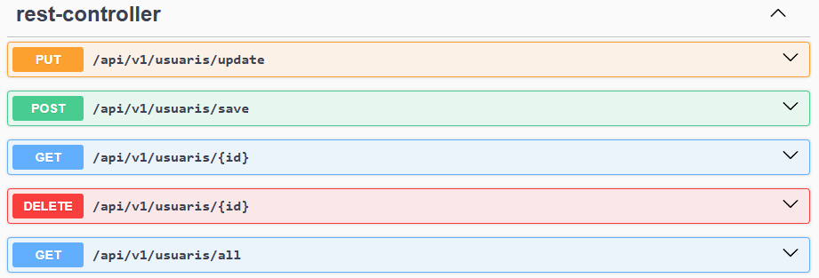
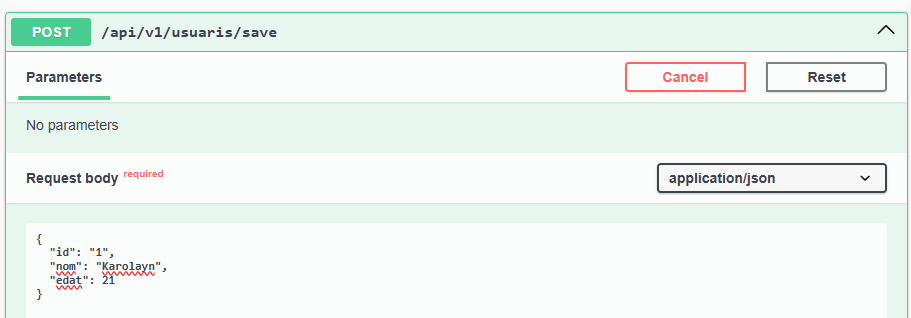
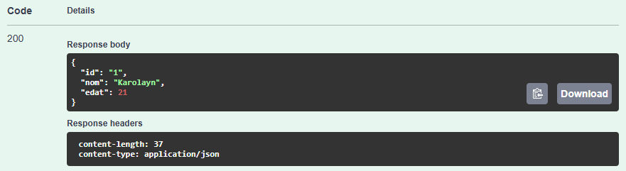
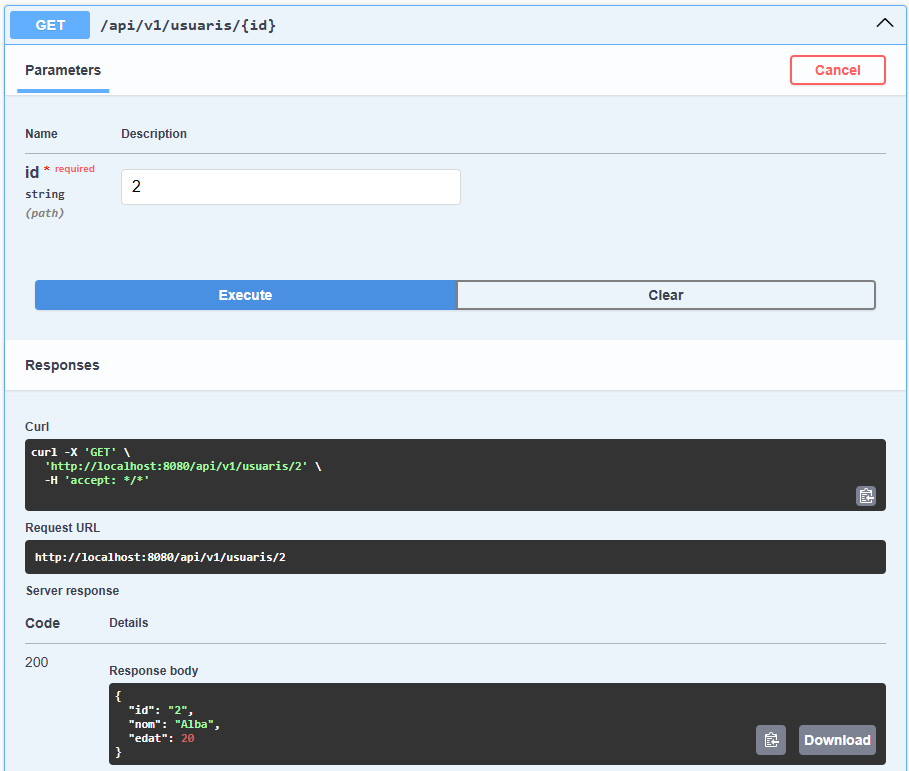
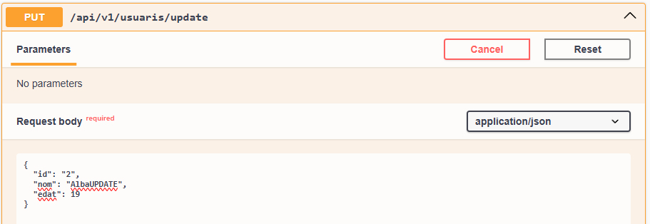
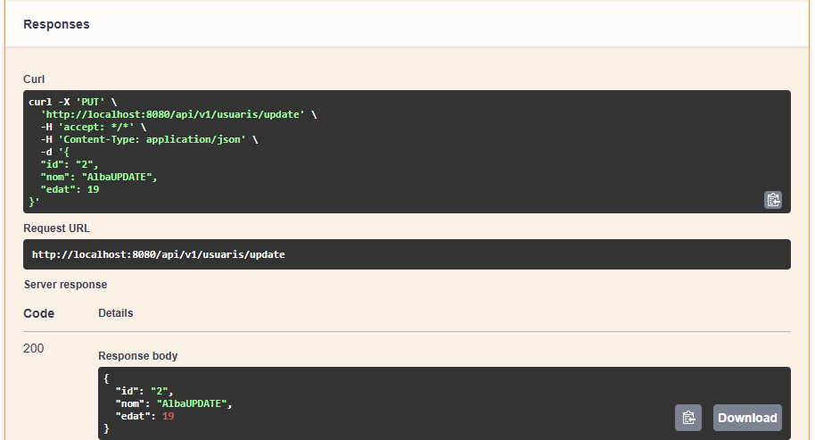
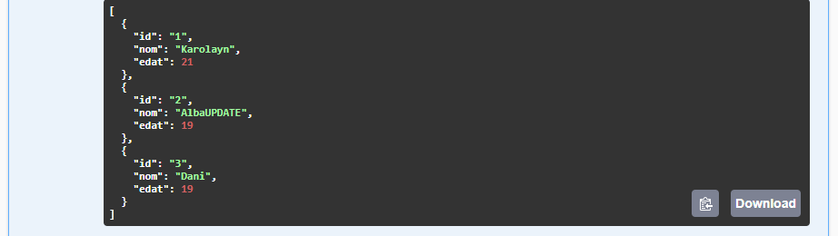
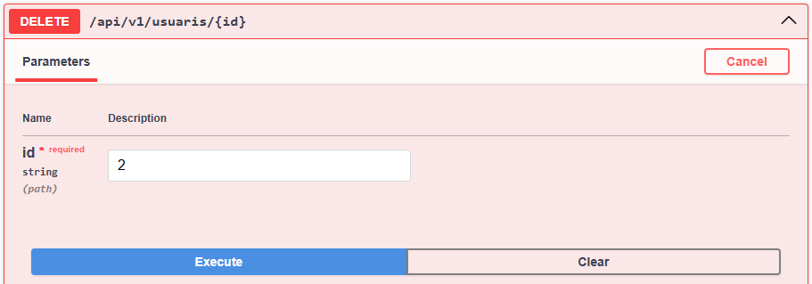
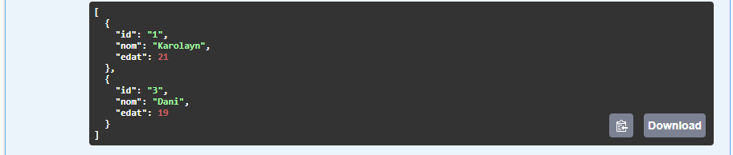

# API_Mongo
## Acosta Daniel, Munoz Karolayn i Segura Alba

### Endpoints de l'API
L’API proporciona els següents endpoints:

- POST /api/v1/usuaris/save:
Creació d'usuari:

- GET /api/v1/usuaris/{id}:
Trobar usuari per id:

- PUT /api/v1/usuaris/update:

Usuari existent:

Usuari existent modificat:

- GET /api/v1/usuaris/all:
Tots els usuaris existents:

- DELETE /api/v1/usuaris/{id}:

Usuaris existents:

Usuaris existents després d'eliminar:

