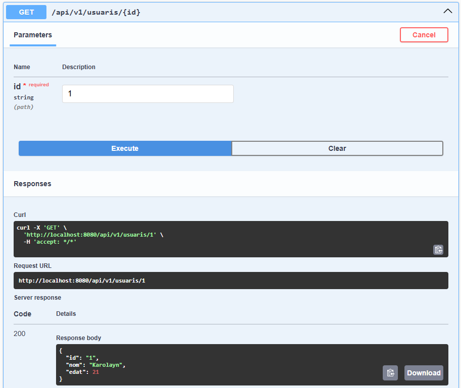
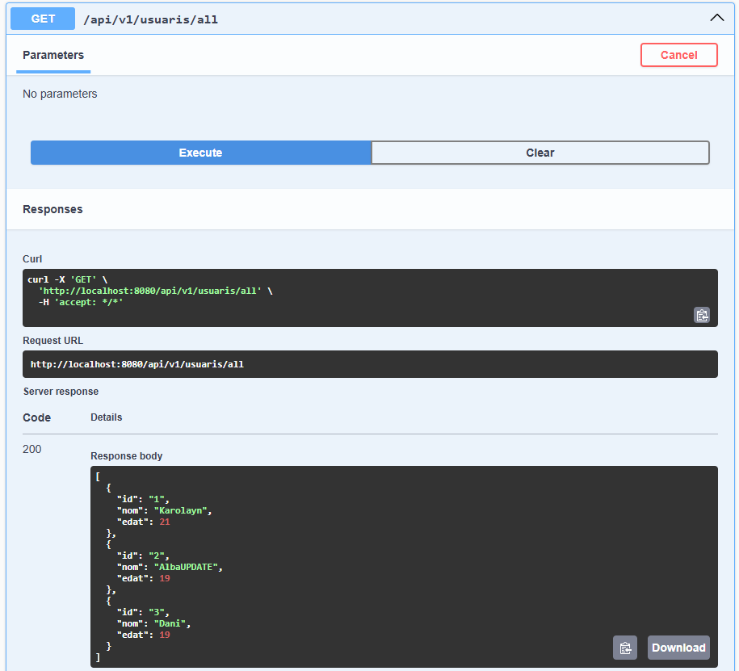

# API_Mongo
## Acosta Daniel, Munoz Karolayn i Segura Alba

### Millores i preguntes de reflexió
1. Afegiu un endpoint que cerqui per un camp de tipus String on feu servir regex. Afegiu el que calgui al servei, repositori, etc.

Usuaris amb "an":

Usuaris amb "la":

2. Què caracteritza una api reactiva com aquesta i què la fa diferent d’una api síncrona amb MVC com les treballades anteriorment?

3. Què signifiquen Mono i Flux? Per a què penseu que serveixen i per què són útils en aquest tipus de programació?

4. Què és record? Un record utilitza getters i setters? Justifiqueu la resposta

### Endpoints de l'API
L’API proporciona els següents endpoints:

- POST /api/v1/usuaris/save:
Creació d'usuari:

- GET /api/v1/usuaris/{id}:
Trobar usuari per id:

- PUT /api/v1/usuaris/update:

Usuari existent:

Usuari existent modificat:

- GET /api/v1/usuaris/all:
Tots els usuaris existents:

- DELETE /api/v1/usuaris/{id}:

Usuaris existents:

Usuaris existents després d'eliminar:

